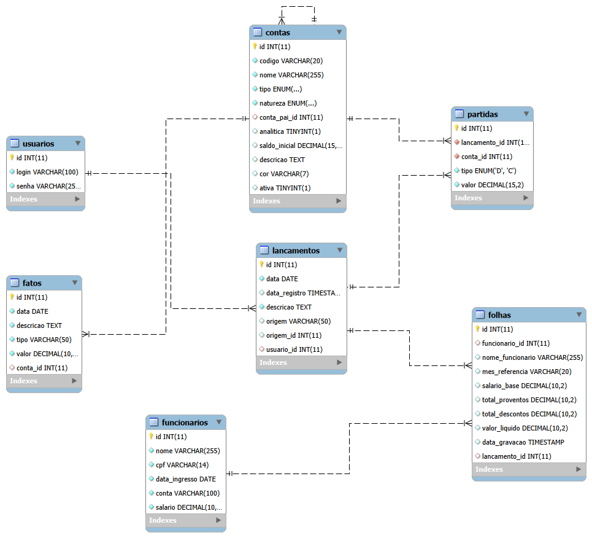

# Jungle Cont


Sistema contábil formal baseado no método das Partidas Dobradas, desenvolvido para gestão financeira de pequenas e médias empresas.

## Sobre

O **Jungle Cont** é um sistema web completo de contabilidade que permite:
- Cadastro de Plano de Contas hierárquico
- Lançamentos contábeis com validação automática
- Gestão de funcionários e folha de pagamento
- Relatórios contábeis (Diário, Razão, Balancete, DRE, Balanço Patrimonial)
- Interface moderna e intuitiva

## Tecnologias

- **Backend**: Node.js com MariaDB
- **Frontend**: HTML5, CSS3, JavaScript (Vanilla)
- **Banco de Dados**: MariaDB (via Docker)
- **Autenticação**: JWT com cookies

## Funcionalidades

### Cadastros
- **Plano de Contas**: Estrutura hierárquica com contas sintéticas e analíticas
- **Funcionários**: Gestão de colaboradores com salário e conta de provisão

### Escrituração
- **Lançamentos**: Entrada de fatos contábeis com validação de partidas dobradas
- **Livro Diário**: Registro cronológico de todos os lançamentos
- **Livro Razão**: Extrato detalhado por conta específica

### Relatórios
- **Balancete de Verificação**: Verificação do equilíbrio contábil
- **DRE**: Demonstração do Resultado do Exercício
- **Balanço Patrimonial**: Visão da situação patrimonial

### Pessoal
- **Folha de Pagamento**: Cálculo e geração automática de lançamentos contábeis
- **Holerite**: Emissão de comprovantes de pagamento

## Estrutura do Projeto

```
Jungle Cont/
├── backend/
│   ├── server.js          # Servidor HTTP e APIs
│   ├── init.sql            # Script de inicialização do banco
│   ├── package.json        # Dependências do backend
│   └── node_modules/       # Módulos do Node.js
├── frontend/
│   ├── css/                # Estilos globais e específicos
│   ├── js/                 # Lógica JavaScript de cada página
│   ├── img/                # Imagens e logos
│   └── *.html              # Páginas do sistema
├── docs/                   # Documentação adicional
└── docker-compose.yml      # Configuração Docker
```

## Banco de Dados



O sistema utiliza o **MariaDB** como banco de dados relacional. A estrutura é organizada nas seguintes tabelas:

### Tabelas Principais

- **usuarios**: Usuários do sistema com autenticação via JWT
- **contas**: Plano de contas hierárquico (Ativo, Passivo, PL, Receitas, Despesas)
- **lancamentos**: Cabeçalho dos lançamentos contábeis (data, descrição, origem)
- **partidas**: Itens dos lançamentos (débito/crédito, conta, valor)
- **funcionarios**: Cadastro de colaboradores com salário e conta de provisão
- **folhas**: Histórico de folhas de pagamento geradas

### Relacionamentos

- `partidas.lancamento_id` → `lancamentos.id`
- `partidas.conta_id` → `contas.id`
- `lancamentos.usuario_id` → `usuarios.id`
- `folhas.funcionario_id` → `funcionarios.id`
- `folhas.lancamento_id` → `lancamentos.id`
- `contas.conta_pai_id` → `contas.id` (autorelacionamento para hierarquia)

### Acesso Externo

O banco de dados é acessível via:
- **Docker**: Porta 3306 exposta no host
- **Credenciais**:
  - Host: `localhost`
  - Porta: `3306`
  - User: `jungle_user`
  - Password: `jungle_password`
  - Database: `jungle_cont`

Para acessar via MySQL Workbench ou outro cliente, use as credenciais acima.

## Acesso ao Sistema

Na primeira inicialização, use as credenciais padrão:

| Campo | Valor |
|-------|-------|
| **Login** | `admin` |
| **Senha** | `admin123` |

> ⚠️ Recomenda-se criar um novo usuário e remover o `admin` após o primeiro acesso.

## Como Usar


### 1. Cadastre o Plano de Contas
No menu **Cadastros → Plano de Contas**, adicione as contas necessárias para sua empresa seguindo a estrutura padrão brasileira (Ativo, Passivo, PL, Receitas, Despesas).

### 2. Faça Lançamentos Contábeis
No menu **Lançamentos**, registre os fatos contábeis diários:
- Preencha data e descrição
- Adicione partidas (débito e crédito)
- Verifique o equilíbrio (barra verde)
- Clique em "Registrar Lançamento"

### 3. Consulte os Relatórios
- **Diário**: Ver todos os lançamentos em ordem cronológica
- **Razão**: Ver extrato de uma conta específica
- **Balancete**: Verificar equilíbrio geral
- **DRE**: Analisar receitas e despesas
- **Balanço**: Ver situação patrimonial

### 4. Gestão de Folha
No menu **Folha**, cadastre funcionários e gere folhas de pagamento. O sistema cria automaticamente os lançamentos contábeis correspondentes.

## Segurança

- Autenticação via JWT com cookies seguros
- Validação de sessão em todas as páginas
- Proteção contra SQL injection via prepared statements
- CORS configurado para ambiente local

## Docker

O sistema utiliza Docker para facilitar a implantação:

### Serviços
- `jungle_cont_backend`: Servidor Node.js (porta 3000)
- `jungle_cont_db`: MariaDB (porta 3306)

### Comandos Úteis
```bash
# Iniciar containers
docker-compose up -d

# Parar containers
docker-compose down

# Ver logs
docker-compose logs -f

# Reiniciar backend
docker restart jungle_cont_backend

# Executar SQL no banco
docker exec jungle_cont_db sh -c "mariadb -u jungle_user -pjungle_password < /tmp/init.sql"
```

## Princípios Contábeis

O sistema segue o método das **Partidas Dobradas**:
- Todo lançamento afeta pelo menos duas contas
- Total de Débitos = Total de Créditos
- Contas sintéticas agrupam, contas analíticas recebem lançamentos

## Contribuindo

Contribuições são bem-vindas! Sinta-se à vontade para abrir issues e pull requests.

